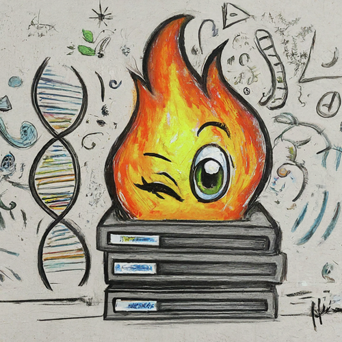
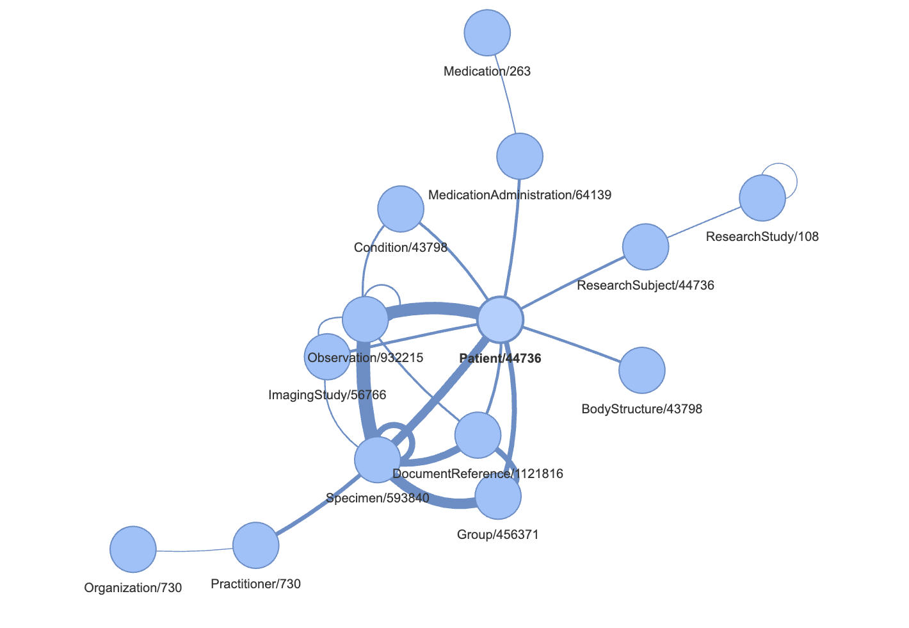

# fhirizer

[](https://opensource.org/licenses/MIT)





### Project overview:
Transforms and harmonizes data from Genomic Data Commons (GDC), Cellosaurus cell-lines, International Cancer Genome Consortium (ICGC), and Human Tumor Atlas Network (HTAN) repositories into 🔥 FHIR (Fast Healthcare Interoperability Resources) format.

- #### GDC study simplified FHIR graph 


## Usage 
### Installation

- from source 
```
git clone repo
cd fhirizer
# create virtual env ex. 
# NOTE: package_data folders must be in python path in virtual envs 
python -m venv venv-fhirizer
source venv-fhirizer/bin/activate
pip install . 
```

- Dockerfile

```
(sudo) docker build -t <tag-name>:latest .
(sudo) docker run -it  --mount type=bind,source=<path-to-input-ndjson>,target=/opt/data --rm <tag-name>:latest
```

- Singularity 
```
singularity build fhirizer.sif docker://quay.io/ohsu-comp-bio/fhirizer
singularity shell fhirizer.sif
```

### Convert and Generate

Detailed step-by-step guide on FHIRizing data for a project's study can be found in the [project's directory overview](https://github.com/bmeg/fhirizer/blob/master/projects).

- GDC 
  - convert GDC schema keys to fhir mapping
  - generate fhir object models ndjson files in directory

    Example run for patient - replace path's to ndjson files or directories. 
 
  ``` 
  fhirizer generate --name case --out_dir ./projects/<my-project>/META --entity_path ./projects/<my-project>/cases_key.ndjson
  ``` 

  - to generate document reference for the patients
  
  ``` 
  fhirizer generate --name file --out_dir ./projects/<my-project>/META --entity_path ./projects/<my-project>/files_key.ndjson
  ``` 

- Cellosaurus 

  - Cellosaurus ndjson follows [Cellosaurus GET API](https://api.cellosaurus.org/)  json format
  
  ```
   fhirizer generate --name cellosaurus --out_dir ./projects/<my-project>/META --entity_path ./projects/<my-project>/<cellosaurus-celllines-ndjson>
  ```

- ICGC

  - NOTE: Active site and data dictionary updates from [ICGC DCC](https://dcc.icgc.org/) to [ICGC ARGO](https://platform.icgc-argo.org/) is in progress.
  
  ```
   fhirizer generate --name icgc --icgc <ICGC_project_name> --has_files
  ```
- HTAN
  
FHIRizing HTAN depends on the: 
1. Folder hierarchy with naming conventions as below and existance of raw data pulled from HTAN
```
fhirizer/
|-- projects/
|   └── HTAN/ 
|         └── OHSU/
|               |-- raw/ 
|               |    |--  files/
|               |    |      |-- table_data.tsv
|               |    |      └── cds_manifest.csv
|               |    |--  biospecimens/table_data.tsv
|               |    └──  cases/table_data.tsv
|               └── META/
```
2. existance of chembl DB file
```
fhirizer/
|-- resources/
      └── chembl_resources/chembl_34.db

```

Example run: 

for all available atlases under ./projects/HTAN/<Atlas name>
  ```
   fhirizer generate --name htan 
  ```
or for one or more: 
```commandline
fhirizer generate --name htan --atlas "OHSU,DFCI,WUSTL,BU,CHOP"
```

G3T validate FHIRized ndjson files: 
```commandline
for i in $(ls projects/HTAN); do echo $i && g3t meta validate projects/HTAN/$i/META; done
```

### Constructing GDC maps cli cmds 

initialize initial structure of project, case, or file to add Maps

```
fhirizer project_init 
# to update Mappings run associated labels script ex ./labels/project.py 

fhirizer case_init 
fhirizer file_init 
```

### FHIR data validation 

#### disable gen3-client
```
mv ~/.gen3/gen3_client_config.ini ~/.gen3/gen3_client_config.ini-xxx
mv ~/.gen3/gen3-client ~/.gen3/gen3-client-xxx
```

#### Run validate
```
fhirizer validate --path <path_to_META_folder_with_fhir_ndjson_files>
```

#### Restore gen3-client

```
mv ~/.gen3/gen3-client-xxx ~/.gen3/gen3-client
mv ~/.gen3/gen3_client_config.ini-xxx ~/.gen3/gen3_client_config.ini
  
```

### Testing 
```
pytest -cov 
```

### fhirizer structure:

Data directories included in package data:
- **resources**: data resources generated or used in mappings
- **mapping**: json data maps produced by fhirizer pydantic schema maps
****
```
fhirizer/
|-- fhirizer/
|   |-- __init__.py
|   |-- labels/
|   |   |-- __init__.py
|   |   |-- files.py
|   |   |-- case.py
|   |   └── project.py
|   |   
|   |-- schema.py
|   |-- entity2fhir.py
|   |-- mapping.py
|   |-- utils.py
|   └── cli.py
|   
|-- mapping/
|   |-- project.json
|   |-- case.json
|   └── file.json
|  
|-- resources/
|   |-- gdc_resources/
|   |   |-- content_annotations/
|   |   |-- data_dictionary/
|   |   └── fields/
|   └── fhir_resources/
| 
|-- tests/
|   |-- __init__.py
|   |-- unit/
|   |   |-- __init__.py
|   |   └── test_mapping.py
|   |-- integration/
|   |   |-- __init__.py
|   |   |-- test_generate.py
|   |   └── test_convert.py
|   └── fixtures/
| 
|-- projects/
|   └── GDC/ 
|   |     └── TCGA-STUDY/
|   |           |-- cases.ndjson
|   |           |-- filess.ndjson
|   |           └── META/
|   └── ICGC/
|   |     └── ICGC-STUDY/ 
|   |            |-- data/
|   |            └── META/
|   └── HTAN/ 
|         └── OHSU/
|               |-- raw/ 
|               |    |--  files/
|               |    |      |-- table_data.tsv
|               |    |      └── cds_manifest.csv
|               |    |--  biospecimens/table_data.tsv
|               |    └──  cases/table_data.tsv
|               └── META/
|              
|              
|--README.md
└── setup.py
```
